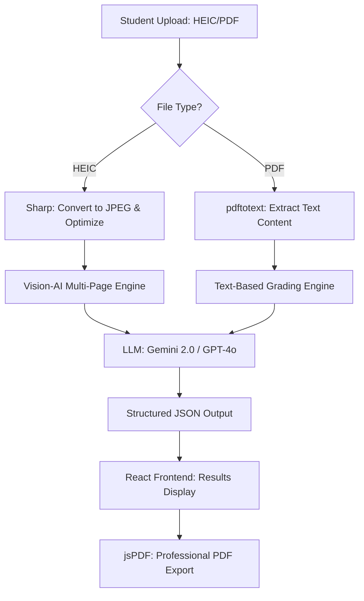

# AI Math Grader: Technical Architecture

This document provides a deep dive into the AI orchestration and data processing pipeline of the AI Math Grader. This is designed for technical interview preparation.

## 🏗️ System Overview

The application is built on **Next.js 16** and uses a modular AI architecture. It supports two primary grading paths: a streaming path (Vercel AI SDK) and a structured path (LangChain).

### Data Flow Diagram



## 🔗 LangChain Implementation (LCEL)

The project leverages **LangChain Expression Language (LCEL)** to create a declarative, modular chain for grading.

### Architecture Choice: Why LangChain?
- **Composability**: Separates the prompt, model, and output parser into distinct, reusable components.
- **Type Safety**: Uses Zod schemas to guarantee that the LLM response follows our `GradingResult` interface.
- **Provider Agnostic**: Easily switch between OpenAI, Anthropic, and Google with zero changes to the core logic.

### The Grading Chain
```typescript
const gradingChain = RunnableSequence.from([
  promptTemplate,         // 1. Injects exam text & student answers
  model,                  // 2. Calls selected LLM (Gemini/Sonnet/GPT-4)
  new JsonOutputParser()  // 3. Ensures valid JSON for the frontend
]);
```

## 👁️ Vision-AI Pipeline

Handling handwritten math requires specific optimizations:

1.  **Image Optimization**: HEIC files are high-resolution. We use `sharp` to resize images (max 2048px) and reduce quality (85%) to stay within LLM token limits while maintaining OCR clarity.
2.  **Multimodal Prompting**: We pass the official exam text and the images simultaneously. The prompt instructs the model to "scan all provided images to find the answer for Question X," enabling multi-page context.
3.  **Swedish Specialization**: The system prompt contains explicit instructions for Swedish mathematical notation (e.g., using a comma as a decimal separator and understanding terms like "summa" or "potens").

## 🚀 Key Technical Challenges Solved

### 1. The "Ink-Efficient" PDF Problem
Instead of a simple screenshot (which uses excessive black ink), we implemented a manual **jsPDF** drawing engine. It calculates text wrapping, page breaks, and layout dynamically to produce a professional, black-on-white document.

### 2. Provider Flexibility
Using a custom `providers.ts` wrapper, the app can switch models globally via the `.env` file. This allows the user to use the most cost-effective model (like Gemini 2.0 Flash) without refactoring.

### 3. Node.js PDF Parsing
Standard libraries like `pdfjs-dist` often fail in strict Node.js environments. I replaced them with a robust system-level `pdftotext` call, significantly improving reliability for large exam papers.

---
*Prepared for Technical Review - January 2026*
